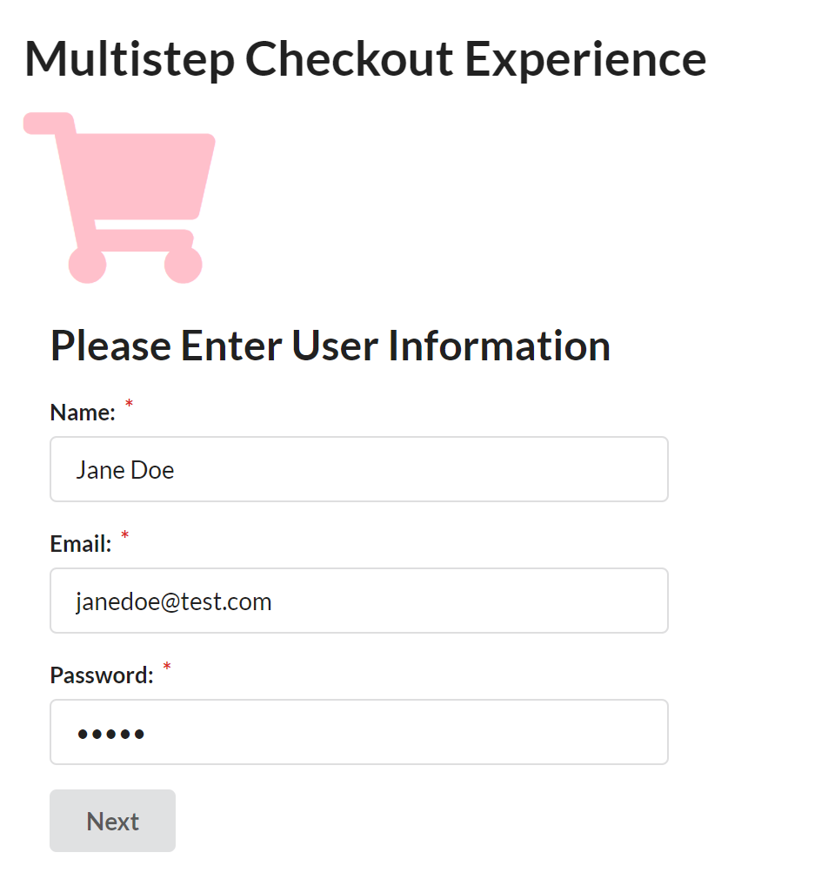
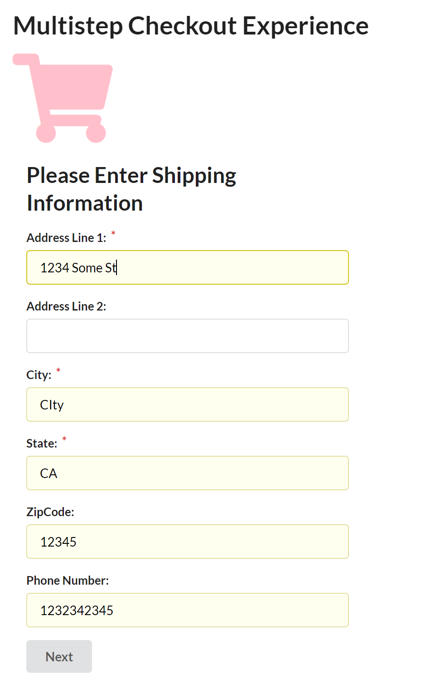
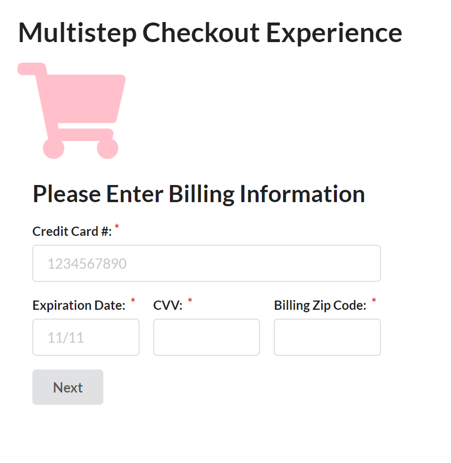
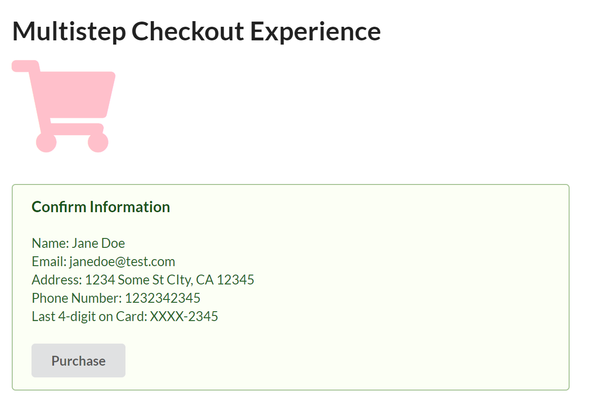

# Multistep Checkout Experience

### Summary

This is a single-page app that takes a user through a series of forms that simulate a shopping cart checkout experience.

- Uses Express to serve up an index.html file and its associated assets
- UI using ReactJS and pre-compile your views using Babel
- Uses MySQL to store user data

At each step, a Next button allows the user to progress to the next step in the checkout process. The final step is a confirmation page which summarizes the data collected in the prior three steps. This page contains a Purchase button that completes the purchase. When the purchase is complete, the user is returned to the homepage.

